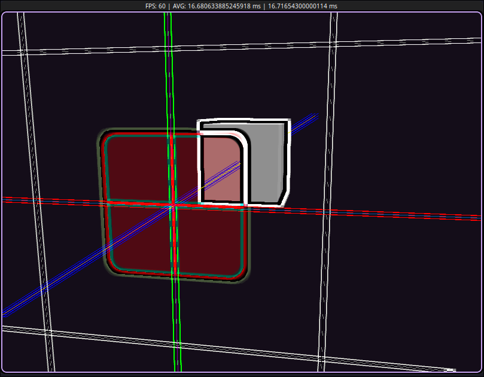

# Nova (2026-06-26) 3D game engine hobby project

## Installing System Dependencies

- ./scripts.setup-linux.sh

## Building & Running Engine

- ./scripts/build.sh
- ./scripts/run.sh

## Building & Running Tests

- ./scripts/build-tests.sh
- ./scripts/run-tests.sh

## Loading Docs

- ./scripts/docs.sh

## Progress

### Week 1 — June 26–July 2

- Vectors
- Shaders
- First Triangle
- EBO , VBO & VAO
- Color Vertex data

### Week 2 — July 3–9

- Shader class
- Textures & texture class
- UV / Texture Coordinates
- Mipmaps
- Texture Filtering
- Transformations
- Matrices
- Coordinate systems

### Week 3 — July 10–16

- Complete Architecture redesign
- ECS-style framework
- Camera
- LookAt Matrix
- Arbitrary Axis Rotation
- Input

### Week 4 — July 17–23

- Ambient, Diffuse & Specular lighting
- Normals & Normal Matrix
- Light entity
- Material properties
- Emission
- Diffuse , Specular & Emission maps
- Unit Tests
- Directional Lights , Point Lights & Spot Lights
- Entity hierarchy (Entities can have child entities)
- Multiple Lights
- Event Bus

### Week 5 — July 24–30

- Assimp model loading
- Shader Include preprocessing
- Change Detection/Dirty system for variables/attributes
- Parent Child transform relations

### Week 6 — July 31–August 6

- Basic calc 1 derivatives

### Week 7 — August 7–13

- Added Doxygen for docs
- basic limits

### Week 8 — August 14–20

- vcpkg package management
- basic calc 1 integration

### Week 9 — August 21–28

- complex arithmetic
- quaternion arithmetic & rotation conversions
- depth, stencil & blending added as per material configurations
- per mesh face culling configurations
- redesigned texture system
- Framebuffers & Renderbuffers
- Cubemaps
- Uniform buffers

### Week 10 — August 29–September 4

- Geometry shaders
- Instancing
- MSAA (Multisample anti-aliasing)
- DSA (Direct State Access)

